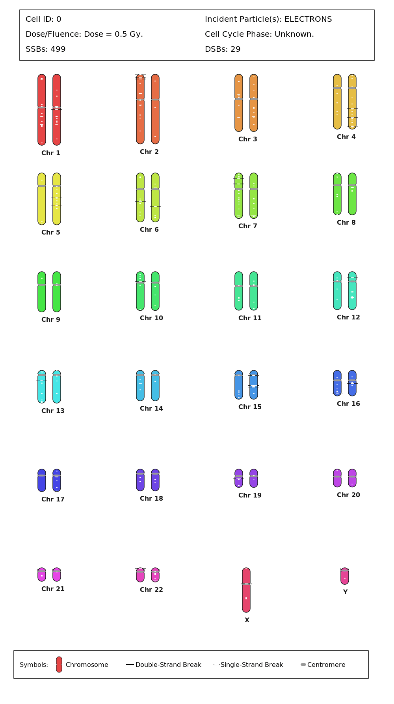
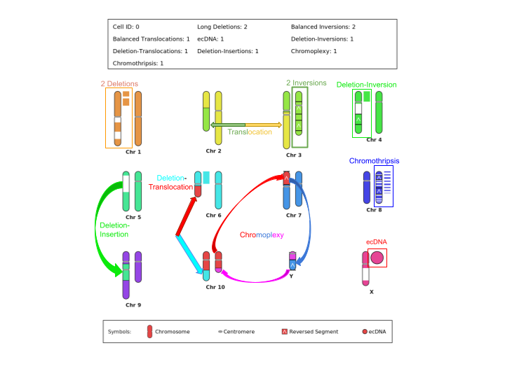

# SDDparser
Writing a C++ toolkit capable of parsing the Standard for DNA Damage (SDD) file header and data fields,
and the Standard for DNA Repair (SDR) header and data fields, drawing the cairo-based karyogram visualizations
of the associated damages and mutations. 

This package is now capable of summarizing the SDD header fields and the data fields into a single summary file. It can also optionally plot a 
karyogram of the double-strand break and single-strand break locations onto the chromosomes the user passes in the SDD file header. 
This package can also accomodate the SDR file format in the same way as the SDD file, by summarizing the mutations specified
in the SDR file for each cell, as well as optionally plotting the karyogram of the mutations specified in the SDR file.

Available both as a **command-line tool** and as a **linkable C++ library**
you can embed in your own project.

## Dependencies

- A C++17 compiler (`g++` or equivalent)
- [Cairo](https://www.cairographics.org/) (`libcairo`) — required for karyogram drawing

On Debian/Ubuntu: `sudo apt install libcairo2-dev`
On macOS (Homebrew): `brew install cairo`

## Building

```
make        # builds the SDDparser CLI executable (and, as part of that, the library)
make lib    # builds only the static library, libSDDparser.a
make clean  # removes build artifacts
```

---


## HOW TO USE AS A COMMAND-LINE EXECUTABLE PROGRAM:
1. To compile the SDDparser program, navigate to the directory where the Makefile is stored: 'cd /path/to/SDDparserDirectory/'.

2. Ensure g++ is installed on your computer by checking "g++ --version". The terminal should return the version number and license.

3. Ensure you have installed the libcairo2-dev library for plotting the associated Karyogram to the SDD file.

3. Simply type 'make' into your terminal to compile the program 'SDDparser'. No warnings or errors should appear. 

4. To run the SDDparser and generate a summary of either the SDD or SDR file, type in the command line 

```
./SDDparser <SDD file> [--karyogram human|other]
./SDDparser -sdr <SDR file> [--karyogram human|other]
```

Examples:

```
./SDDparser exampleSDD.txt
./SDDparser exampleSDD.txt --karyogram human
./SDDparser -sdr exampleSDR.txt
./SDDparser -sdr exampleSDR.txt --karyogram human
```

Each run writes a `<input>_summary.txt` file next to the input, and, if
`--karyogram` is passed, one `<input>_cell<N>_karyogram_<human|other>.png`
per exposure/cell found in the file. 

The outputs after parsing an SDD file should resemble:

'SDD header parsed successfully.
Summary written to: "exampleSDD_summary.txt"
Karyogram generated successfully: "exampleSDD_karyogram_human.png"'

(The exampleSDD_summary.txt file and exampleSDD_karyogram_human.png files should resemble the ones shown in the attached files of this repository in the
examples/ folder).

The outputs after parsing an SDR file should resemble:

'Summary written to: "exampleSDR_summary.txt"
Karyogram generated successfully: "exampleSDR_cell0_karyogram_human.png"'

The exampleSDR_summary.txt file and exampleSDR_cell0_karyogram_human.png files should resemble the ones shown in the attached files of this repository in
the examples/ folder).


5. The SDD/SDR file summary will be stored in a file labeled '<SDDinputFile|SDRinputFile>_summary.txt' in the same directory as the SDDinputFile/SDRinputFile.

6. If you decide to plot the Karyogram of the SDD/SDR file illustrating the locations of the single- and double-strand breaks on each of the chromosomes, 
or the mutations on each chromosome, respectively you can specify either 'human' for human genome centromere positions or 'other' for generic centromere
locations. The output .png file will be stored in the same directory as the SDD/SDR input file.

7. IMPORTANT: The karyogram can now handle the user passing 'Chromosome sizes' in the SDD and SDR header in the following three ways 
(example for human chromosomes) :

	a. Split homolog chromosome sizes layout: 1,2,3,...,22,1,2,3,...,22,Y,X.

	b. Adjacent homolog chromosome sizes layout: 1,1,2,2,3,3,...,22,22,Y,X.

	c. Non-homologous/haploid chromosome sizes layout: 1,2,3,...,22,Y,X.

In the SDD/SDR chromosome sizes header, please specify Y chromosome size before X. If the user passes two X chromosomes, the second one will be labeled as Y
and will have an incorrect centromere position in the karyogram. 
The plotter also works for more than 46 chromosomes, but the '--karyogram other' option must be specified by the user if that is the case.
If the user desires, the cell cycle phase can also be specified in the SDD header, and the karyogram plotter will account for if the cell cycle phase 
is pre-replication (G0 or G1 phase) or post-replication (S, G2, M phase). If the user passes '0' (unspecified) as the cell cycle phase, the plotter 
will assume the cells are in a pre-replication phase. In addition to the chromosome number and sizes passed in the SDD header, the karyogram plotter 
also requires SDD data fields 3, 4, and 6, otherwise the chromosome sizes and damage information will not be present to draw the karyogram. 
For the SDR file, only the intact chromosome sizes header field is required, and the corresponding SDR data entries for mutations (intact chromosome
entries are optional).

****PLEASE ENSURE THE CHROMOSOME IDS IN SDD DATA FIELD 3 AND SDR DATA FIELD 3 CORRESPOND TO THE CORRECT CHROMOSOME SIZE INDEX 
LISTED IN THE SDD HEADER, OTHERWISE THE KARYOGRAM PLOTTER WILL BE INCORRECT****


### WHAT IS SUMMARIZED IN THE SDD FILE SUMMARY:
All important header fields are interpreted and summarized in a text format at the beginning of the summary file.
The header summary is separated into 3 main subsections:
1. Incident Radiation Information - describes the type of radiation particle simulated.
2. Radiation Target Information - describes the cell/nucleus model that was irradiated in the simulation.
3. DNA Damage Information - describes the damage definition for the appearance of Double Strand Breaks, and other exposure information.

The data block is summarized under the subsection 'Chromosome Damages', where the following information is summarized:
1. The number of cell exposures contained in the SDD file (number of cells irradiated).
2. The number of damage entries (data rows) per cell exposure.
3. The associated damages per chromosome per cell exposure (i.e. number base damages, single-strand breaks, and double-strand breaks)
4. Total number of base damages, single-strand breaks, and double-strand breaks over all chromosomes per cell exposure.
5. The total number of base damages, single-strand breaks, and double-strand breaks over all chromosomes over all cell exposures.

### WHAT IS PLOTTED IN THE SDD FILE KARYOGRAM:
<p align = "center">
<br>
<em> Increasing DNA damages as a function of dose resulting from secondary electrons of a primary 6 MeV photon beam.</em>
</p>

1. All chromosomes passed by the user are plotted with distinct colors for visual clarity.
2. Centromeric positions using the '--karyogram human' option are realistic and adjusted based on the chromosome being drawn, whereas 
non-human genomes will be drawn using the generic centromere locations at approximately 50% of the chromosomes length. 
3. Double-strand breaks are denoted using black lines spanning slightly more than the width of the chromosome to disitnguish from single-strand breaks.
4. Single-strand breaks are denoted using white lines on the chromosomes and the line lengths are scaled based on the number of single-strand breaks 
within a given damage site (i.e. a given SDD data row) (usually between 0-5 SSBs). 
5. Summary at the top to describe the dose or fluence in the SDD file, the cell cycle phase, and the number of single- and double-strand breaks.
6. Legend at the bottom to describe what each symbol signifies in the karyogram.

### WHAT IS SUMMARIZED IN THE SDR FILE SUMMARY:
1. SDR version, author, associated SDD file that produced the SDR file from the MEDRAS-MC output.
2. Number of chromosomes listed and their respective sizes in mega base pairs.
3. Per Cell summary of the cell subheader (number of double-strand breaks and misrepairs).
4. Number of mutations per each type.

### WHAT IS PLOTTED IN THE SDR FILE KARYOGRAM 
1. Summary at the top, including which cell the Karyogram is plotted for, and the number of each mutation type.
2. Chromosomes plotted with their associated homologs if specified, and structural rearrangements from the associated mutations. 
3. The colors are used to depict where the chromosomal rearrangements came from, the white sections indicate where the deletions occurred on the 
original chromosomes. Extrachromosomal DNA (ecDNA) is drawn as circles with their diameters scaled to the length of the deleted segment for visual
clarity.
4. A legend of symbols at the bottom of the karyogram to denote what all the symbols mean, particulary for inversions and ecDNA.
5. So far, drawing is supported for long deletions, balanced inversions, balanced translocations, ecDNA, deletion-inversions, deletion-translocations,
and deletion-insertions, chromoplexy and chromothripsis. 

<p align = "center">
<br>
<em> Depicting common DNA structural variations that arise from ionizing radiation.</em>
</p>


## FURTHER KARYOGRAM PLOTTING WORK:
1. Add a zoom in and out and a panning option to conserve image quality. 
2. Add functionality to be able to receive two X chromosomes instead of a Y and X chromosome and be able to plot them on the karyogram. 
... and much more.


---

## USING SDDparser AS A LIBRARY

Everything the library exposes lives in the `sddparser` namespace. Include the single umbrella header to get all three public classes at once:

```cpp
#include <SDDparserLibrary.h>
```

Link against `libSDDparser.a` and `cairo`:

```
g++ -std=c++17 -I/path/to/SDDparser/include -o my_program my_program.cpp \
    /path/to/SDDparser/libSDDparser.a -lcairo
```

### Parsing an SDD file — `sddparser::SDDparser`

```cpp
#include <SDDparserLibrary.h>
#include <fstream>
#include <iostream>

int main()
{
    sddparser::SDDparser parser;

    if (!parser.load("exampleSDD.txt"))
    {
        std::cerr << "Failed to load SDD file\n";
        return 1;
    }

    const sddparser::Header& header = parser.getHeader();
    const std::vector<sddparser::Exposure>& exposures = parser.getExposures();

    std::cout << "SDD version: " << header.sdd_version << "\n";
    std::cout << "Exposures found: " << exposures.size() << "\n";

    // Write the same text summary the CLI tool produces, to any std::ostream.
    std::ofstream summaryFile("summary.txt");
    parser.printSummary(summaryFile);

    return 0;
}
```

**Public interface:**

| Method | Description |
|---|---|
| `bool load(const std::string& filename)` | Parses the given SDD file. Returns `false` on failure. |
| `const Header& getHeader() const` | The parsed SDD header fields (dose, chromosome sizes, cell cycle phase, etc.). |
| `const std::vector<Exposure>& getExposures() const` | One `Exposure` per cell/exposure in the file, each holding its own damage records. |
| `void printSummary(std::ostream& out) const` | Writes a human-readable summary of the header and every exposure's damage to any output stream. |

### Parsing an SDR file — `sddparser::SDRparser`

```cpp
#include <SDDparserLibrary.h>
#include <iostream>

int main()
{
    sddparser::SDRparser parser;

    if (!parser.parseFile("exampleSDR.txt"))
    {
        std::cerr << "Failed to parse SDR file\n";
        return 1;
    }

    const sddparser::SDRmasterHeader& masterHeader = parser.getMasterHeader();
    const std::vector<sddparser::SDRsubHeader>& subHeaders = parser.getSubHeaders();

    std::cout << "SDR version: " << masterHeader.sdrVersion << "\n";
    std::cout << "Cells parsed: " << subHeaders.size() << "\n";

    // Write the text summary (mutation counts, breakpoints, etc.) to a file.
    parser.writeSummary("summary.txt");

    return 0;
}
```

**Public interface:**

| Method | Description |
|---|---|
| `bool parseFile(const std::string& filename)` | Parses the given SDR file. Returns `false` on failure. |
| `const SDRmasterHeader& getMasterHeader() const` | Master header fields — chromosome sizes, SDR version, etc. |
| `const std::vector<SDRsubHeader>& getSubHeaders() const` | One `SDRsubHeader` per cell, each holding that cell's data records. |
| `bool writeSummary(const std::string& outputFilename) const` | Writes a text summary of every detected mutation type per cell (deletions, inversions, translocations, ecDNA, deletion-inversions, deletion-translocations, deletion-insertions, chromoplexy, chromothripsis) to the given file. |

### Drawing a karyogram — `sddparser::Karyogram`

One `Karyogram` instance can draw both SDD-style damage karyograms and SDR-style rearrangement karyograms.

**From SDD data:**

```cpp
sddparser::Karyogram karyogram;
sddparser::SDDparser parser;
parser.load("exampleSDD.txt");

const sddparser::Header& header = parser.getHeader();

for (const sddparser::Exposure& exposure : parser.getExposures())
{
    std::vector<sddparser::Exposure> singleExposure = {exposure};

    karyogram.generateKaryogram(
        header.chromosome_sizes,
        header.cell_cycle_phase,
        header.dose_or_fluence,
        header.incident_particles,
        singleExposure,
        /*humanGenome=*/true,
        "cell" + std::to_string(exposure.exposureID - 1) + "_karyogram.png"
    );
}
```

**From SDR data:**

```cpp
sddparser::Karyogram karyogram;
sddparser::SDRparser parser;
parser.parseFile("exampleSDR.txt");

for (const sddparser::SDRsubHeader& subHeader : parser.getSubHeaders())
{
    karyogram.generateSDRkaryogram(
        parser.getMasterHeader(),
        subHeader,
        /*humanGenome=*/true,
        "cell" + std::to_string(subHeader.cellID) + "_karyogram.png"
    );
}
```

**Public interface:**

| Method | Description |
|---|---|
| `bool generateKaryogram(chromosomeSizes, cellCyclePhase, doseOrFluence, incidentParticles, exposures, humanGenome, outputFilename)` | Draws a damage karyogram (SSB/DSB markers) for one exposure from SDD data. |
| `bool generateSDRkaryogram(masterHeader, subHeader, humanGenome, outputFilename)` | Draws a structural-rearrangement karyogram (deletions, inversions, translocations, ecDNA, chromoplexy, chromothripsis, and more) for one cell from SDR data. |

`humanGenome = true` draws real human centromere positions; `false` uses a generic centromere at the midpoint of each chromosome.


APPENDIX:

Example SDR file mutated data entries for each type, the exact same as exampleSDR_with_dicentrics.txt, with additional comments:
** NOTE: In reality, the order of the SDR data entries do not matter, but they are logically ordered in the exampleSDR.txt file for clarity**

-- Multiple Deletions per chromosome:

0; 47; 5/88.0/137.4/0, 5/181.2/192.2/0; 1;

0; 48; 5/137.4/181.2/0; 1;

0; 49; 5/0/88.0/1; 1;


-- Multiple balanced inversions per chromosome, with inverted centromere-bearing fragment:

0; 51; 3/0/100.8/1, 3/120.5/100.8/0, 3/120.5/150.9/0, 3/173.2/150.9/0, 3/173.2/212.4/0; 1;


-- Different balanced translocation examples:

- Central fragments translocate leading to dicentric and acentric strands:

0; 52; 2/0/80/0, 1/130/190/0, 2/170/258.1/0; 1;

0; 53; 1/0/130/1, 2/80/170/1, 1/190/263.2/0; 1;

- Simple translocation where the top of one chromosome swaps with the bottom of another:

0; 66; 26/203.4/75.3/0, 30/60/155.5/0; 1;

0; 67; 26/0/75.3/1, 30/60/0/1; 1;

- The same as the previous example: 

0; 68; 13/121.3/73.2/0, 9/20.7/149.4/1; 1;

0; 69; 13/0/73.2/1, 9/20.7/0/0; 1;

- Balanced translocation between central fragments not leading to dicentrics

0; 70; 12/0/70.0/1, 16/60.0/78.0/0, 12/100.0/140.8/0; 1;

0; 71; 16/0/60.0/1, 12/70.0/100.0/0, 16/78.0/94.7/0; 1;


-- ecDNA mutations:

- Multiple ecDNA per chromosome strand

0; 54; 36/0/55.0/1, 36/70.0/88.0/0, 36/100.0/113.0/0; 1;

0; 55; 36/55.0/70.0/0; 0;

0; 56; 36/88.0/100.0/0; 0;

- Multiple deletions recombining into one larger ecDNA:

0; 57; 15/0/30.0/1, 15/50.0/70.0/0, 15/90.0/106.9/0; 1;

0; 58; 15/30.0/50.0/0, 15/70.0/90.0/0; 0;


-- Deletion-Inversion, deleted segment has centromere 

0; 59; 8/0/44.0/0, 8/112.5/85.0/0, 8/112.5/155.5/0; 1;

0; 60; 8/44.0/85.0/1; 1;


-- Deletion-translocation examples:

- Translocation of central segments, leading to dicentric and acentric strands:

0; 61; 10/0/20/0, 11/79.0/120/0, 10/100/144/0; 1;

0; 62; 11/0/79.0/1, 10/20/65/1, 11/120/142.9/0; 1;

0; 63; 10/65.0/100.0/0; 1;

- Translocation of terminal segments, leading to dicentric and acentric strands:

0; 88; 33/0/79/1, 32/65/0/1; 1;

0; 89; 33/142.9/79/0, 32/100/144/0; 1;

9; 90; 32/65/100/0; 1;


-- Deletion-Insertion mutation, leading to dicentric and acentric chromosomes:

0; 64; 23/0/130/1, 24/50/150/1, 23/130/263.2/0; 1;

0; 65; 24/0/50/0, 24/150/258.1/0; 1;


-- Simple chromoplexy case:

0; 72; 41/0/20.0/0, 39/15/83.5/1; 1;

0; 73; 40/0/70.0/1, 39/15.0/0/0; 1;

0; 74; 40/81.0/70.0/0, 41/20.0/68.0/1; 1;


-- Chromothripsis examples:

- Chromothripsis involving only one chromosome:

0; 75; 6/0/15/0, 6/25/15/0, 6/30/35/0, 6/50/62/1, 6/70/62/0, 6/70/75/0, 6/85/80/0, 6/98/105/0, 6/126/105/0, 6/135/140/0, 6/155/168/0, 6/174/181.8/0; 1;

0; 76; 6/25/30/0; 1;

0; 77; 6/35/50/0; 0;

0; 78; 6/75/80/0; 1;

0; 79; 6/85/98/0; 1;

0; 80; 6/126/135/0; 1;

0; 81; 6/140/155/0; 1;

0; 82; 6/168/174/0; 1;

- Chromothripsis involving two chromosomes:

0; 83; 25/0/35/0, 29/145/155/0, 25/50/65/0, 25/80/65/0, 25/85/95/1, 29/32/16/0, 25/130/200/0, 29/16/0/0; 1;

0; 84; 25/212.4/200/0, 29/32/60/1, 25/35/50/0, 29/130/70/0, 29/130/145/0, 29/155/168.8/0; 1;

0; 85; 25/80/85/0; 1;

0; 86; 25/98/130/0; 1;

0; 87; 29/60/70/0; 1;

